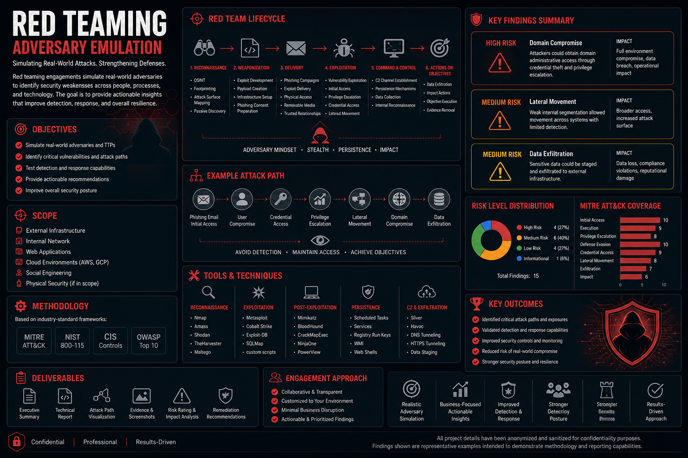
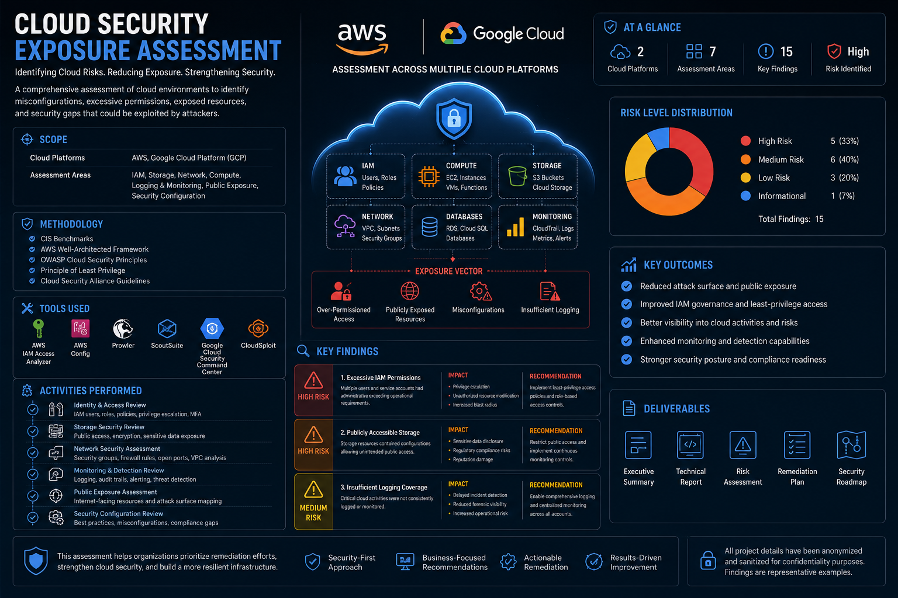
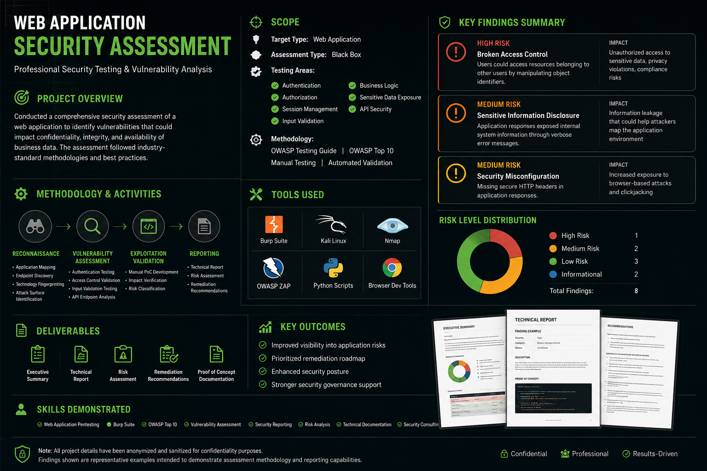

# Rachel Bullmann

> Offensive Security • Red Team • Cloud Security • Attack Surface Management

Security professional focused on adversary emulation, penetration testing, attack surface analysis, and cloud security assessments.

---

## Areas of Expertise

* Red Team Operations
* Web Application Security
* Cloud Security (AWS & GCP)
* Attack Surface Management (ASM)
* Vulnerability Assessment
* Threat Modeling
* Security Automation
* Identity & Access Management (IAM)

---

# Featured Security Assessments

## Red Team Adversary Emulation

### Scope

* External Infrastructure
* Internal Network
* Web Applications
* Cloud Environments
* Social Engineering

### Highlights

* Attack Path Discovery
* Privilege Escalation
* Lateral Movement
* Persistence Techniques
* MITRE ATT&CK Mapping

---

## Cloud Security Exposure Assessment

### Focus Areas

* IAM Review
* Public Exposure Analysis
* Storage Security
* Network Security
* Security Monitoring
* Cloud Misconfiguration Assessment

### Platforms

* AWS
* Google Cloud Platform (GCP)

---

## Web Application Security Assessment

### Methodology

* OWASP Top 10
* Authentication Testing
* Authorization Testing
* Session Management Review
* API Security Assessment

---

# Security Tooling

## Offensive Security

* Burp Suite
* Kali Linux
* Nmap
* BloodHound
* Cobalt Strike
* Metasploit

## Cloud Security

* Orca Security
* AWS Security Hub
* AWS Config
* CloudTrail
* IAM Access Analyzer

## Automation

* Python
* Bash
* GitHub Actions

---

# Current Projects

### Attack Surface Management Platform

Building an ASM platform focused on:

* Asset Discovery
* Exposure Analysis
* Risk Prioritization
* Security Automation
* Executive Reporting

---

# Certifications & Learning

* Offensive Security
* Cloud Security
* Red Team Operations
* Adversary Emulation
* Security Automation

---

# Connect

LinkedIn: [Your LinkedIn URL]

Email: [your-email@example.com](mailto:your-email@example.com)
